# 3D游戏开发术语

翻译自JME官方wiki。原文：[3D Game Development Terminology](http://jmonkeyengine.github.io/wiki/jme3/terminology.html)

## 3D游戏开发术语

开始学习之前，确保你熟知如下概念和术语。

### 3D图形和音频

**<abbr title="Open Graphics Library">OpenGL</abbr>** 即开放式图形库，是一个用来渲染二维或三维计算机图形的跨平台的专业图形程序接口。对于Java来说，有两种基于OpenGL实现的渲染器。

1. 轻量级Java游戏库 (LWJGL)
2. Java开放图形库 (JOGL)

**<abbr title="Open Audio Library">OpenAL</abbr>** 即开放式音频库，是一个跨平台的3D音频程序接口。

### 环境，显示，渲染器

jME环境(Context)为JME3游戏提供了所需的一切，包括：配置管理、渲染器、计时器、输入监听器、事件监听器和显示系统。

* **jME显示系统** 替代了Java Swing组件，用于绘制jME自定义窗口。
* **输入系统** 可以让你对用户输入做出反应，包括：鼠标点击、鼠标滑动、键盘输入、手柄操作等。
* **渲染器(Renderer)** 用于处理将3D场景图绘制到2D屏幕上的所有计算工作。
 * **染色器(Shader)**是整个渲染管线的编程部分，jME3游戏引擎用它制作高级自定义材质。

### 几何(Geometry)

#### 多边形，网格，顶点

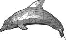

3D场景里大部分的可见物体都是由多边形网格组成的——角色、地形、建筑等等。网格(Mesh)是一种可以表达复杂形状的网状结构。网格的优点是，从数学角度讲足够简单，可以实时处理形状变化，细节上也足够辨认该物体。

每个形状都可以简化成一定数量相互连接的多边形(通常是三角形)。即便是圆形表面，比如球体，也可以简化成由许多三角形组成的网格形状。

多边形的拐角称作顶点，每个顶点都可以用坐标定位，所有顶点一起就可以标绘出该物体的大致轮廓。

你可以使用3D建模工具来创建3D网格，比如用Blender、3D Max、Maya、ZBrush等。jME可以加载3D网格模型，并把它们布置到场景里，但是引擎自己不能编辑网格。

### 材质：颜色、光照/着色

我们称作“颜色”的东西，仅仅是物体反射光的一部分。人脑用明暗对比和反射光推断物体的形状和材质。这些因素共同作用，使观察者能够区别粉笔与牛奶，皮肤与纸张，水与塑料等不同的物体。[外部例子](http://www.shaders.org/ifw2_textures/whatsin10.htm)

#### 颜色

##### <abbr title="Ambient Color">环境颜色</abbr>

* 网格物体的基色，就是当物体不受任何光源影响时显现出的颜色。
* 通常类似漫反射颜色。
* 是使该物体肉眼可见所需最少的颜色。

##### <abbr title="Diffuse Color">漫反射颜色</abbr>

* 网格物体的基色加上受光源影响发出的碎光和阴影。
* 通常类似环境颜色
* 也叫作固有颜色

#### 光源

##### <abbr title="Emissive Color">发光色</abbr>

* 由光源或发光材质散发出的光的颜色。
* 只有发光材质，比如光源，才有发光色，普通物体不具备此特性。
* 一般是白色(太阳光)。

#### 反光

##### <abbr title="Shininess">反光度</abbr>

* 物体表面的反光程度(1~128)。
* 有光泽的物体可以发出小面积的、轮廓清晰的反射光。(例如：玻璃、水、银器等)
* 普通物体的反射光通常是大面积的、模糊的。（例如：塑料、石头、抛光材质等）
* 凹凸不平的物体表面没有光泽。(例如：衣服、纸张、木头)反射颜色通常设置为ColorRGBA.Black(黑色)。

##### <abbr title="Specular Color">高光颜色</abbr>

* 如果是有光泽的材质，那么它的高光颜色就是反射光的颜色。
* 通常和光源的发光颜色一样(例如白色)。
* 你可以用不同的颜色来制造特殊的反射效果，比如金属色泽或彩虹炫色。
* 无光泽物体的高光颜色是黑色的。

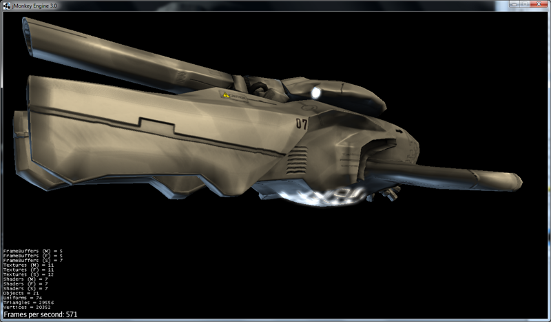

### 材质：纹理

纹理是材质的一部分。最简单的情况是，一个物体只有一种纹理，只需要从图片文件中导入颜色贴图(Color Map)就行。回想一下老式电脑游戏，你就知道做这方法做出来的东西看起来很素了。

你(游戏设计者)把颜色贴图(Color Map)做得越详细，细节度和真实度就越高。无论你想做到像拍照一样的真实感，还是像卡通片一样的赛璐珞风格(Cel Shading)，这完全取决于你的材质和纹理的质量。最新的3D图形技术使用多个图层来描述一份材质，每个图层就是一张纹理。

> 没有纹理图片？在[opengameart.org](http://opengameart.org/)上面下载免费纹理吧！记得使用纹理图片要尊重它的版权声明哦！

#### 纹理映射

##### 颜色贴图/漫反射贴图

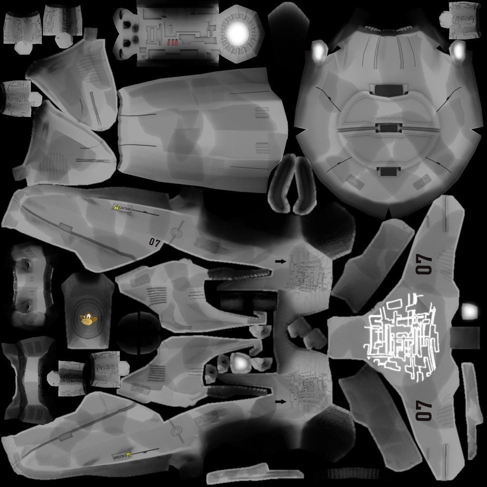

* 是一个纯图片文件或程序纹理，用来描述物体可见的表面外观。
* 该图片可以有Alpha透明通道。
* 一张颜色贴图是最少的纹理。你可以做多个纹理映射，以改善画面质量。
* 颜色贴图(Color Map)是没有经过渲染的。在Phong照明材质里这被称作漫反射贴图(Diffuse Map)，因为纹理决定了物体漫反射光的基本色。

##### 凸凹贴图(Bump Map)

凸凹贴图是用来描述细节形状的，因为在网格编辑器里塑造细节形状会很费事，而且效率很低。有2种类型的凸凹贴图可用：

* 用法线贴图(Normal Map)为细微之处塑模，比如墙壁裂纹、锈迹、皮肤纹理，或者帆布的编织纹理。([更多关于凸凹贴图](http://en.wikipedia.org/wiki/bump_mapping))
* 用高度图(Height Map)为打过莫地形塑模，包括深谷和山脉。

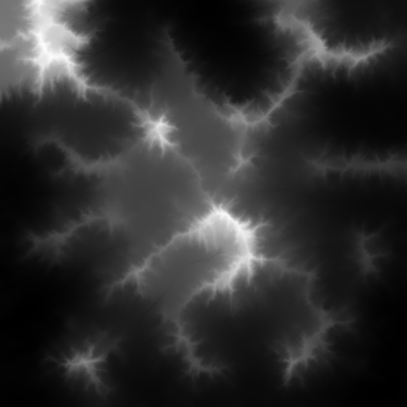

###### 高度图

* 高度图就是灰度图，看起来像地形学历用的地形图。亮度高的灰度代表较高地区，较暗灰度代表低洼地区。
* 高度图可以分为256个高度等级，用来勾勒地形轮廓。
* 你可以在任何图形编辑器里手绘高度图。

###### 法线贴图

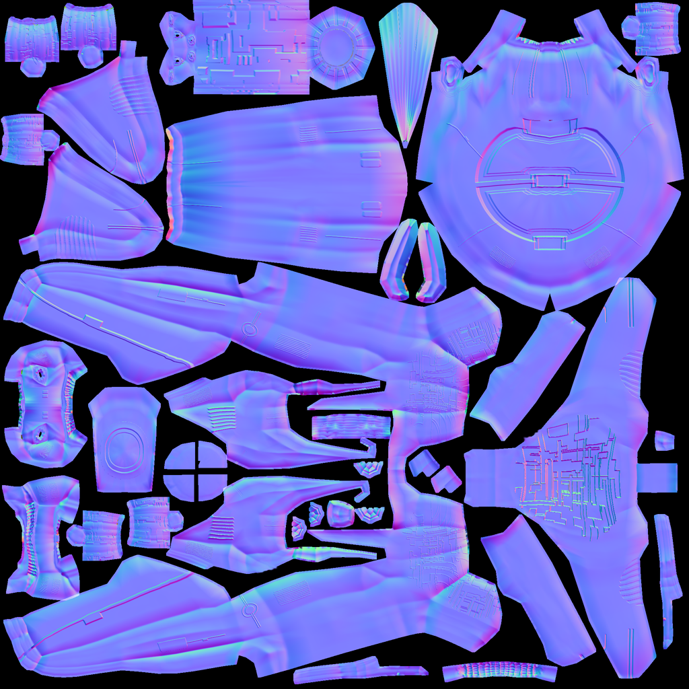

* 做得好的法线贴图会让物体轮廓显得更精致——勿需再浪费精力给网格增加多边形。法线贴图里包含细微变化信息，让物体看起来更光滑，纹理更细密。

* 如果在图形编辑器里打开法线图，它看起来就像上错色的颜色贴图。但是法线图不是用来上色的，它里面的颜色是用来计算表面凸凹程度和裂缝的编码位移数据的。位移数据用斜面的表面法线表示，正如它的名字。

* 你不能手动绘制或者手工编辑法线贴图，专业设计师用专用软件在高质量3D模型上通过运算的方法获得法线贴图。你可以花钱买专业的纹理图集，或者找那种包括法线贴图的免费图集。

##### 高光贴图(Specular Map)

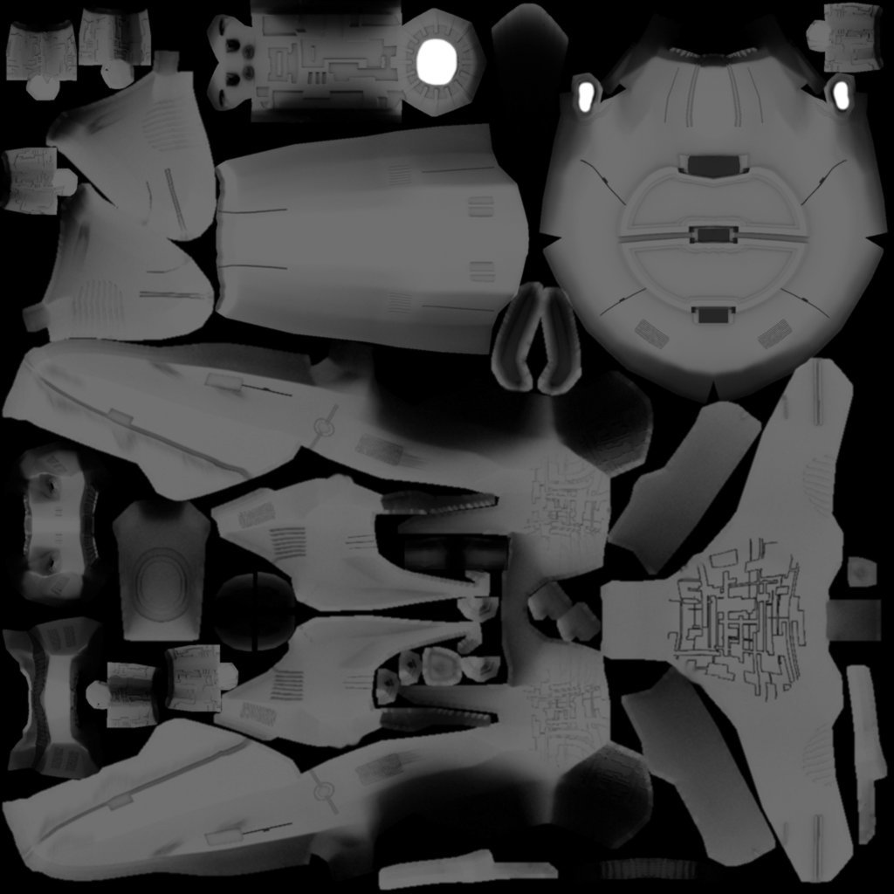

* 高光贴图可以进一步改善物体表面真实感：它包含亮度的额外信息，使物体光照效果看起来更加逼真。

* 先复制一份中等灰度的漫反射贴图，所谓中等灰度是对应该材质的平均光度/钝度来说的。然后给较平滑、较闪亮、反射较强的区域增加较高亮度的灰度，或者把较暗、较粗糙、破旧的区域的灰度调暗。最后得到的图片看起来类似漫反射贴图的灰度级版本。

* 你可以利用高光贴图里的颜色达成某种特殊反射效果(假晕彩，金属效果)。

#### 无缝拼接纹理

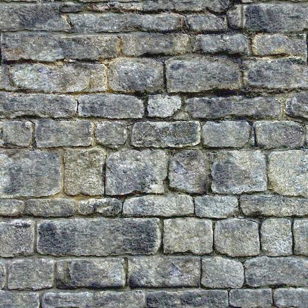

拼接纹理(Tiles)是一种简单常用的纹理类型。为一大片区域(如墙壁、地板)构造纹理的时候，不需要做大幅的纹理图片，而是做一小片纹理然后不断拼接直到填满整个区域。

无缝纹理是一种经过特殊设计或改良的图片文件：它的右边可以拼接左边，顶边可以拼接底边。观众不容易辨别哪儿是头哪儿是尾，这样造成错觉以为是一大幅完整的纹理。但是对于复杂一点的模型，比如角色，你就不能使用这种纹理了。

有关辅导材料请参考： [如何用Photoshop做无缝纹理](http://www.photoshoptextures.com/texture-tutorials/seamless-textures.htm)

#### UV贴图 / 纹理贴图集

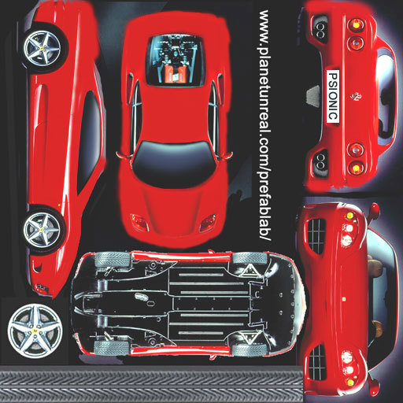

给立方体形状贴纹理容易——但是如果是角色，有面部和肢体，怎么办呢？对形状更复杂的物体，其纹理设计参照平面缝纫模式：即一个图形文件里包含物体前面、后面和侧面轮廓信息，一个接着一个。将指定的平面纹理区域(UV坐标表示)贴到3D模型(XYZ坐标表示)的指定区域，称为UV映射。使用UV映射(也叫纹理图集)的方法，一个模型的每个面都可以有不同的纹理。你可以为每种纹理建立一个相关UV映射。

精确地找到接缝然后正确拼接显得十分重要：你必须需要某种图形工具(比如Blender)来创建UV贴图(纹理图集)，还要依序保存坐标。值得花点功夫学习这方面技能，UV贴图模型看起来专业多啦。

#### 环境映像

环境映像，或者说反射映像，用来模拟实时反射和折射效果。这种方法比离线渲染程序中使用的射线追踪方法速度快，但是精确度低。

你可以用立方图的方法表现周围环境；球面图也可以，但是看起来会变形失真。总的来说，就是把周围环境当成环境贴图，设计一整套图片来表现背景场景的360°视图——非常类似天空盒的表现形式。然后用渲染器做环境映射，做出反射表面的纹理，最后得到满意的"玻璃、镜面、水"效果。就像天空盒，反射贴图是静止的，移动的物体(比如行走的人)不属于反射效果的一部分。

#### 多对一贴图

MIP是拉丁文 "multum in parvo"，英文Many in one，意为多对一。

多对一贴图(MIP Map)的意思是在一个图片文件中，为一个纹理提供两个或三个不同分辨率的图像。取决于摄像机的远近，引擎自动地为物体选择跟多(或更少)的纹理细节。这样物体近看很精致，远看也很不错。

这种方法什么都好，美中不足的就是要花时间去制作纹理，还需要额外空间存储纹理文件。如果你不想自己做，jMonkeyEngine可以自动创建基本的MIP贴图，用于性能优化。

#### 程序纹理

程序纹理的制作方法是不断重复一个小图片，外加一些伪随机和梯度变化(称作Perlin噪声)。程序纹理比静态矩形纹理看起来更自然，球面失真度小。对大型网格物体，这种重复纹理看起来比无缝凭借纹理更自然。程序纹理若用于不规则大面积结构物体，效果更为立项，比如草地，土壤，石块，锈迹，还有围墙。可用jMonkeyEngine的 [Neo Texture插件](http://wiki.jmonkeyengine.org/sdk/neotexture.html) 来制作程序纹理。

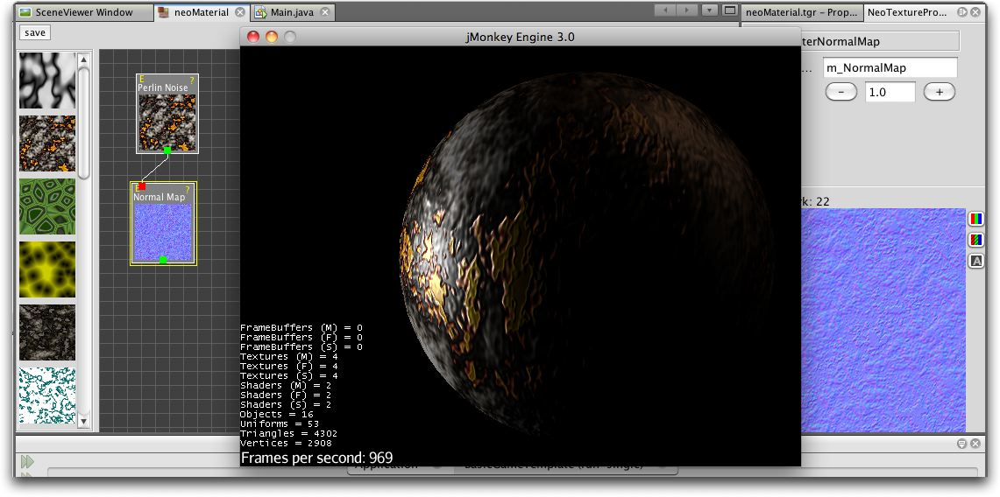

还可以参见：[用Blender创建材质](http://www.blender.org/education-help/tutorials/materials/), [Blender: 人类已知的各种材质](http://en.wikibooks.org/wiki/Blender_3D:_Noob_to_Pro/Every_Material_Known_to_Man)

### 动画

3D游戏中，骨骼动画用于制作动画角色，理论上骨骼方法可以广泛应用到任何一种3D网格物体。(例如，一个板条箱，它开合的合页可以看做关节。)

除非你真的做过3D动画，否则难以体会，动画角色如何实现往往是十分棘手的问题：角色动作像外星人一样呆板，再不就是断断续续的；角色形象空洞，或者看起来像是飘着的。专业游戏设计人员要花费大量精力让动画角色看起来自然一些，这里面包括要使用[动作捕捉技术](http://en.wikipedia.org/wiki/Motion_capture)。

#### 装配和蒙皮

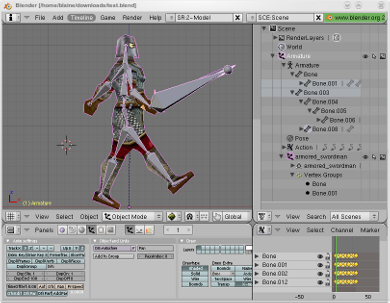

动画角色是有支架的：内里的骨骼(骨头)和外部表面(皮肤)。皮肤是角色的可见外表，此处所谓的皮肤也包括衣服。骨头肉眼不可见，它用来对皮肤的图像渐变做插值(计算)。

JME3游戏引擎只能加载、显示录制好的动画，因此，你必须使用其他工具(比如Blender)创建角色(包括装配、蒙皮、制作动画的过程)。

1. **装配:** 为角色构造骨架。

 *  使用骨头的数量尽量少，以降低复杂度。
 *  骨头之间的连接采用父子层次结构：移动一块骨头会拉着别的骨头跟它一起动(比如运动胳膊会带动手掌)。
 *  骨骼遵循命名规则，这样是为了方便3D引擎区别哪是哪。

2.  **蒙皮:** 把单个骨头与相应的皮肤区域关联起来。

 *  每块骨头都与部分皮肤相连。动画制作的时候，(看不见的)骨头拽着(看得见的)皮肤跟它一起动。例子：大腿骨与大腿上部皮肤的连接。
 *  一块皮肤可能受不止一块骨头的影响。例如：膝盖、肘部。
 *  骨头与皮肤的连接过程是渐进的：你先制定每块多边形皮肤受骨头移动影响的权重。比如：当大腿动作的时候，整条腿全部受影响，髋关节受的影响小一些，而头部完全不受影响。
 *  jMonkeyEngine支持硬件蒙皮(在GPU上运算，而不是CPU)。

3.  **关键帧动画:** 一幅关键帧就是某个动作序列的快照记录。

 *  一系列关键帧构成一个动画。
 *  每个模型可以有多个动画。每个动画都有一个名字，用于辨识(例如：“走”，“攻击”，“跳”)。
 *  你可以在游戏代码里指定加载哪个关键帧动画，指定何时显示它。

> 动画制作(装配、蒙皮、关键帧)与动作变换(旋转、缩放、移动、插值)有何区别？

> *  动作变换比动画制作简单。有时候，做个几何图形变换，看起来似乎就是动画了。比如，旋转的风车，脉动的能量球，机器拉杆的移动。用JME3实现动作变换非常容易。 

> *  然而，动画制作就复杂多了，它以一种特别的编码形式保存(关键帧)。动画制作会扭曲网格皮肤，而且，它有复杂的动作系列，需要借用外部工具记录，再用JME3显示。

#### 运动学

*  正向运动学：假如已知角色所有关节的角度，求该角色手部位置在哪里？
*  逆向运动学：假设已知该角色手部位置，求该角色其它关节的角度是多少？

#### 控制器和频道

在JME3程序中，要把动画模型注册到动画控制器(AnimControl)里。用动画控制器来操作可用的动画序列。控制器有多个频道(AnimChannel)，每个频道一次只能运行一个动画序列。要运行多个动画序列，你就得创建多个频道，然后并行运行它们。

### 人工智能(AI)

对于非玩家(电脑控制的)角色(简称NPC)，只有他们不会蠢得去撞墙或者盲目地跑进火堆里，游戏才会有趣。你希望制作出来的NPC对周遭环境有清醒意识，然后让他们自己根据游戏状态做调整——否则玩家就可以把他们忽略不计了。最常见的用例就是你希望设计出来的对手能对玩家构成威胁，这样互动才有趣。

使游戏变聪明的游戏设计元素，称为人工智能(AI )。人工智能可以用于实现NPC敌人、宠物等；你还可以用他们建立自动报警系统，如果玩家触发了入侵警报，自动报警系统自动锁门，然后召唤警卫。

人工智能涉及下列领域，当然还有其它未列出来的内容：

*  **知识**——知识指的是数据，是AI可以访问的数据，而且AI所做决定是基于该数据的。理想的代理只“知道”它们看到和听到的。它的隐含意思是，为维护游戏公平，信息数据可以绕过AI不让其知晓。你可以设计无所不知的AI，也可以与部分AI共享数据，还可以只让附近的AI知晓当前状态。举个例子：玩家打开无线电了，只有部分装备了双向无线电的AI警卫朝玩家位置移动，而多数其他的警卫当时并没有意识到任何异样。

*  **计划目标**——所谓计划就是AI如何“采取行动”。每个AI都有优先权达成某项具体目标，目的是为达到未来某种状态。编程的时候，你把AI的目标分解成几个小目标。AI求助于它的知识获取当前状态，从储备的战术/战略中甄选，同时做优先排序。AI不停地考察当前状态是否更接近目标。如果不是，AI舍弃当前战术/战略，选择另一个进行尝试。举例：AI在一个不断变化的环境里所搜到达玩家基地的最佳路径，同时还要避开陷阱。AI追踪玩家，目标是消灭他。AI藏起来不让玩家看到，目标是谋杀VIP。

*  **问题解决**——问题解决是AI如何_对干扰做出反应_，就是摆在自己和目标之间的障碍。AI依据一套假定的事实和规则推算自己的状态——基于类似轻微疼痛、剧痛、厌倦或者陷入困境的觉知作出选择。在每个状态里，只有选择具体的反应子集才有意义。实际的反应还取决于该AI的目标，因为AI的行动不一定能阻碍自己的目标！举例：如果玩家接近自己，AI是选择攻击还是隐藏自己，亦或是给出警告？AI空闲的时候，他是布置陷阱呢，还是给自己疗伤，亦或是给魔法符文充能？如果有生命危险，AI是选择逃跑还是与对方同归于尽？

你还可以学习更高级的AI技术，比如利用神经网络。

有趣的AI算法资源还有很多，比如：

*  [A* (A-Star) pathfinding for beginners](http://www.policyalmanac.org/games/aStarTutorial.htm)
*  [A* (A-star) pathfinding theory](http://theory.stanford.edu/~amitp/GameProgramming/)
*  ['Z-Path' algorithm (backwards pathfinding)](http://hem.fyristorg.com/dawnbringer/z-path.html)
*  [GOAP -- Goal-Oriented Action Planning](http://web.media.mit.edu/~jorkin/goap.html)
*  [Neuroph -- Java Neural Networks](http://neuroph.sourceforge.net/)
*  …

### 数学

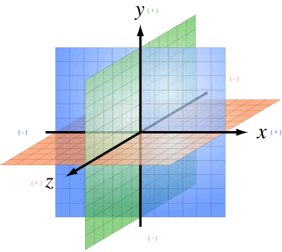

#### 坐标

> jMonkeyEngine基于OpenGL，下文提到的坐标系，是OpenGL所采用的右手坐标系。

坐标代表坐标系统的具体位置。坐标是相对于原点(0,0,0)来说的。在3D空间，你需要指定三个坐标值以便确定某个点的位置：x(右)，y(上)，z(朝向你)。同理。-x(左)，-y(下)，-z(远离你)。相对于向量来说(两者看起来很相似)，坐标是具体的位置，不是方向。

##### 原点

原点就是3D空间的中心点，是三轴交汇点。它的坐标永远是(0,0,0)。

**举例:** `Vector3f origin = new Vector3f( Vector3f.ZERO );`

#### 向量

向量有唯一长度(数学上称为"模")和唯一方向，就像在3D空间里的一枚箭头。向量起点在坐标(x1, y1, z1)或原点，终点在目标坐标(x2, y2, z2)。反方向用负值表示。

**举例:**

    Vector3f v = new Vector3f( 17f , -4f , 0f ); // 起始于原点 (0/0/0)
    Vector3f v = new Vector3f( 8f , 0f , 33f ).add(new Vector3f( 0f , -2f , -2f )); // 起始于坐标(8,-2,31)

##### 单位向量

**单位向量**就是基本向量，它的长度是1个空间单位。由于它的长度是固定的(而且它只能指向一个位置)，因此单位向量唯一变化的只有方向。

*  `Vector3f.UNIT_X`  = ( 1, 0, 0) = 右
*  `Vector3f.UNIT_Y`  = ( 0, 1, 0) = 上
*  `Vector3f.UNIT_Z`  = ( 0, 0, 1) = 前方
*  `Vector3f.UNIT_XYZ` = 1 wu diagonal right-up-forewards

对象量的分量求负，可以改变它的方向。例如：对右方向(1, 0, 0)求负得到左方向(-1, 0, 0)。

##### 标准化向量

**标准化向量**是一个自定义的**单位向量**。标准化向量与**(表面)法向量**并不相同。如果对一个向量做标准化处理，它的方向将保持不变，但是原来指向的坐标就丢失了。

**举例:** 计算角度之前对向量作标准化处理。

##### 表面法线

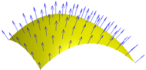

表面法线就是垂直于(正交于)某平面的向量。要计算表面法线，可以做叉乘(向量积)运算。

##### 叉乘

叉乘是用来找垂直向量的运算(正交计算，90°直角)。在3D空间谈到正交这个概念，它只对相对某个平面来说才有意义。你需要两个向量来定义唯一平面。两个向量的叉乘，`v1 * v2`，就是垂直于该平面的向量。垂直于一个平面的向量称为_表面法线_。

**举例:** x单位向量和y单位向量合在一起可以定义x/y平面。垂直于该平面的向量就是z轴。在JME中，下面的计算结果为真：

`( Vector3f.UNIT_X.cross( Vector3f.UNIT_Y ) ).equals( Vector3f.UNIT_Z )` == true

##### 动作变换

动作变换的意思是指在3D场景下，表现物体的旋转、缩放(重新定义大小)或者位移。3D引擎针对这些过程提供简化方法，你写写代码就可以使节点完成动作变换。

**举例:** 3D俄罗斯方块游戏里面下落并旋转的方块。

##### 球面线性插值(Slerp)

Slerp就是球面线性插值的英文单词快读结果，写出来是 Spherical linear interpolation。一个Slerp就是一个插值变换，用来做简化的3D引擎动画。定义初始状态和结束状态，然后slerp插入中间过程，做出从一个状态到另一个状态的等速变换。你可以正常播放、暂停、回放、快进该动作。 [JavaDoc: slerp()](http://javadoc.jmonkeyengine.org/com/jme3/math/Quaternion.html#slerp-com.jme3.math.Quaternion-com.jme3.math.Quaternion-float-))

**举例:** 一个正在燃烧的陨石形状几何体，位置p1，旋转速度r2，缩放比例s1。从天空下坠到地面"p2, r2, s2"，对它做球面线性插值。

### 游戏开发行话

*  [A Game Studio Culture Dictionary](http://www.gamasutra.com/view/feature/6504/a_game_studio_culture_dictionary.php?print=1)

### 3D图形术语wiki百科

*  [3D图形术语](http://en.wikipedia.org/wiki/User:Jreynaga/Books/3D_Graphics_Terms)
